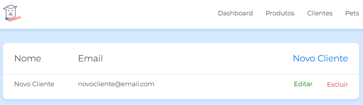
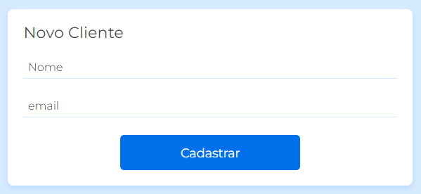
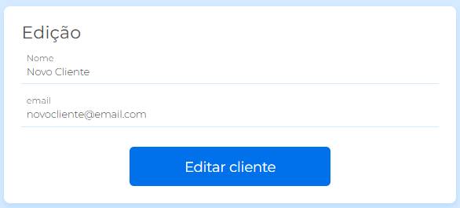
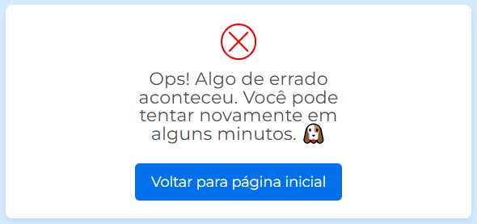

# 🐾 Doguito Petshop 🐶

Uma aplicação para **cadastro, edição e exclusão de clientes** em um petshop, desenvolvida com **JavaScript assíncrono** e operações **CRUD** utilizando **Fetch API**.

 

## 🚀 Sobre o Projeto

Este projeto foi desenvolvido durante o curso da Alura:

* "JS na web: CRUD com JavaScript assíncrono"

O foco foi criar uma aplicação prática para gerenciamento de clientes em um petshop, aplicando conceitos fundamentais de **CRUD**, **Fetch API**, e manipulação de dados assíncronos.

## 📚 Objetivo do curso

* Criar um **CRUD** utilizando o método **fetch** e os verbos **HTTP**;
* Aprender a **consumir dados de uma API** e exibir no seu front-end;
* Entender como utilizar o método **fetch** para consumir dados de uma API;
* Manipular os verbos **HTTP (GET, POST, PUT, DELETE)** através do método fetch;
* Aprender como funcionam as **promises** no JavaScript.

## 🛠️ Tecnologias aprofundadas durante o curso

                                

## 🖼️ Imagens da Aplicação
Uma prévia das principais telas da aplicação **Doguito Petshop**:

**📋 Lista de Clientes**

Tela que exibe todos os clientes cadastrados no sistema.

**📝 Cadastro de Cliente**

Tela para adicionar novos clientes ao sistema.

**✏️ Edição de Cliente**

Tela para atualizar informações de clientes existentes.

**🚨 Mensagem de Erro**

Exibição de mensagem de erro quando há falhas nas operações.

